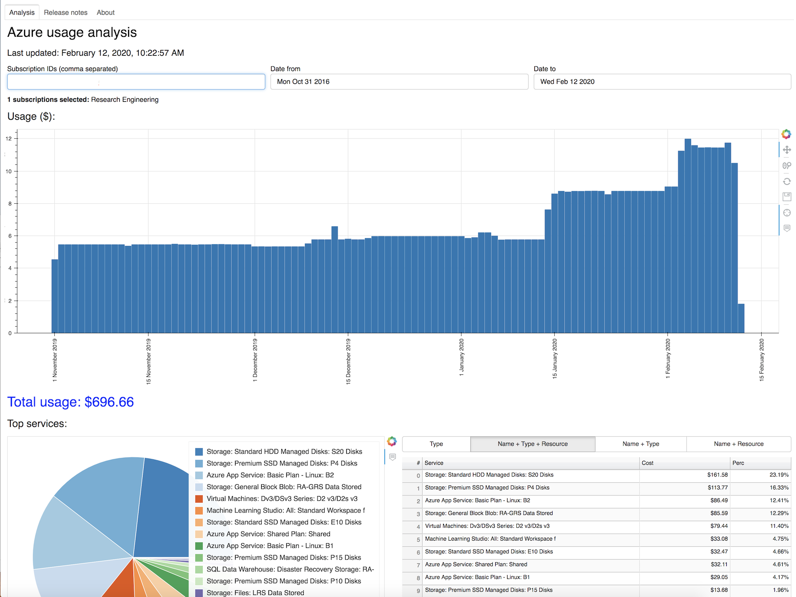

# Azure usage v2
<!--  -->

 

## Summary

Web app for the Turing research community to analyse Azure usage at the subscription level.

Created and designed by [Tomas Lazauskas](https://github.com/tomaslaz).

Webapp is hosted on Azure (https://turingazureusage.azurewebsites.net), and in order to access it, one needs to login with Turing credentials.

## Disclaimer

I endeavour to make reasonable effort to keep the information up to date and correct. However, the web app is only
for demonstration purposes only and make no warranties of any kind, express or implied, about the completeness,
accuracy, reliability, suitability or availability with respect to the web app or the information.

Please keep in mind that the web app is still in development and it doesn’t yet have all the functionality that I
would like it to have.

## Installation

Instructions on how to create the infrastructure required for the webapp can be found [here](INSTALL.md).

## Project contributors
 - The Alan Turing REG team

## Getting help

Any feedback is very welcome! If you found a bug or need support, please submit an issue [here](https://github.com/alan-turing-institute/azure_usage_v2/issues/new).

## How to contribute

Contributions are welcome! If you are willing to propose new features or have bug fixes to contribute, please submit a pull request [here](https://github.com/alan-turing-institute/azure_usage_v2/pulls).
